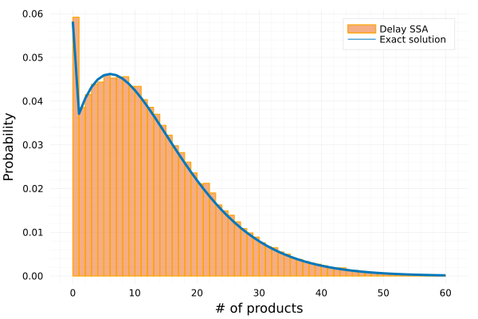

# DelaySSAToolkit

| **Documentation** | **Build Status** |
|:-----------------:|:----------------:|
| [![doc dev badge]][doc dev link] | [![ci badge]][ci link] [![cov badge]][cov link] |

[doc dev badge]: https://img.shields.io/badge/docs-dev-blue.svg
[doc dev link]: https://palmtree2013.github.io/DelaySSAToolkit.jl/dev/

[ci badge]: https://github.com/palmtree2013/DelaySSAToolkit.jl/actions/workflows/CI.yml/badge.svg?branch=main
[ci link]: https://github.com/palmtree2013/DelaySSAToolkit.jl/actions/workflows/CI.yml?query=branch%3Amain

[cov badge]: https://codecov.io/gh/palmtree2013/DelaySSAToolkit.jl/branch/main/graph/badge.svg
[cov link]: https://codecov.io/gh/palmtree2013/DelaySSAToolkit.jl

<!-- [](https://codecov.io/gh/palmtree2013/DelaySSAToolkit.jl) -->

DelaySSAToolkit.jl is a tool developed on top of [DiffEqJump.jl](https://github.com/SciML/DiffEqJump.jl) in Julia which solves the stochastic simulation [[1]](#1) coupled with delays. A portion of this library’s code is taken from the MIT licensed DiffEqJump.jl library. 
That code is copyright (c) 2017: Chris Rackauckas. This package contains the following features:

## Features
- Various delay stochastic simulation algorithms are provided [[2-6]](#2);
- Stochastic delay type is supported;
- Multiple delay channels and simultaneous delay reactions are supported;
- A cascade of delay reactions is supported (a delay reaction that causes other delay reactions);
- Priority queue and dependency graph are integrated for high computational performance;
- Ecosystem with [Catalyst.jl](https://github.com/SciML/Catalyst.jl), [DiffEqJump.jl](https://github.com/SciML/DiffEqJump.jl), [DifferentialEquations.jl](https://github.com/JuliaDiffEq/DifferentialEquations.jl) and more...

More information is available in the [documentation](https://palmtree2013.github.io/DelaySSAToolkit.jl/dev/). Please feel free to open issues and submit pull requests!

## Installation
DelaySSAToolkit can be installed through the Julia package manager:
```julia 
]add DelaySSAToolkit
using DelaySSAToolkit
```
and you might need to run
```julia
using Pkg
Pkg.instantiate()
```
for the first time after installation.


## Examples
### SEIR model
Check [this example](https://palmtree2013.github.io/DelaySSAToolkit.jl/dev/tutorials/tutorials/) for more details.
```julia
using Catalyst # ] add Catalyst
using DelaySSAToolkit
# Model: Markovian part
rn = @reaction_network begin
    ρ, S+I --> E+I
    r, I --> R
end ρ r
u0 = [999,1,0,0] # S, I, E, R
tf = 400.
tspan = (0,tf)
ps = [1e-4, 1e-2]

# Model: non-Markovian part (delay reactions)
τ = 20.
delay_trigger_affect! = function (integrator, rng)
    append!(integrator.de_chan[1], τ) # add a delay time τ to the first delay channel
end
delay_trigger = Dict(1=>delay_trigger_affect!) # the first reaction S+I -> E+I will trigger a delay reaction: E --> I after τ time.  
delay_complete = Dict(1=>[2=>1, 3=>-1]) # E --> I after τ time: transfer from E (minus 1) to I (plus 1) after the completed delay reaction
delay_interrupt = Dict() 
de_chan0 = [[]] # initial condition for delay channel: no on-going delay reactions
delayjumpset = DelayJumpSet(delay_trigger, delay_complete, delay_interrupt)

# convert the ReactionSystem to a JumpSystem
jumpsys = convert(JumpSystem, rn, combinatoric_ratelaws=false)
dprob = DiscreteProblem(jumpsys,u0,tspan,ps)
djprob = DelayJumpProblem(jumpsys, dprob, DelayRejection(), delayjumpset, de_chan0, save_positions=(true,true))
sol = solve(djprob, SSAStepper(),seed=1234)
# ] add Plots
using Plots; theme(:vibrant)
plot(sol, label = ["S" "I" "E" "R"], linewidth = 3, legend = :top, ylabel = "# of individuals", xlabel = "Time", fmt=:png)
```


### A bursty model [[7]](#7)
Check this [example](https://palmtree2013.github.io/DelaySSAToolkit.jl/dev/tutorials/bursty/) for more details.
```julia
using DelaySSAToolkit
using Catalyst
# Model: Markovian part
@parameters a b t
@variables X(t)
burst_sup = 30
rxs = [Reaction(a*b^i/(1+b)^(i+1),nothing,[X],nothing,[i]) for i in 1:burst_sup]
rxs = vcat(rxs)
@named rs = ReactionSystem(rxs,t,[X],[a,b])
u0 = [0]
tf = 200.
tspan = (0,tf)
ps = [0.0282, 3.46]
# Model: non-Markovian part
τ = 130.
delay_trigger_affect! = []
for i in 1:burst_sup
    push!(delay_trigger_affect!, function (integrator, rng)
    append!(integrator.de_chan[1], fill(τ, i))
    end)
end
delay_trigger = Dict([Pair(i, delay_trigger_affect![i]) for i in 1:burst_sup])
delay_complete = Dict(1=>[1=>-1])
delay_interrupt = Dict()
de_chan0 = [[]]
delayjumpset = DelayJumpSet(delay_trigger, delay_complete, delay_interrupt)

# convert the ReactionSystem to a JumpSystem
jumpsys = convert(JumpSystem, rs, combinatoric_ratelaws=false)
dprob = DiscreteProblem(jumpsys, u0, tspan, ps)
djprob = DelayJumpProblem(jumpsys, dprob, DelayRejection(), delayjumpset, de_chan0, save_positions=(false,false))
ensprob = EnsembleProblem(djprob)
ens = solve(ensprob, SSAStepper(), EnsembleThreads(), trajectories=10^5)
```



## Recommendations
To solve a `DelayJumpProblem`, here are few recommendations for good performance:

- Use Catalyst.jl to build your Markovian model (model without delays). For certain algorithms that need dependency graph, it will be auto-generated. 

- For a small number of jumps, `DelayRejection` and `DelayDirect` will often perform better than other aggregators.

- For large numbers of jumps with sparse chain like structures and similar jump rates, for example continuous time random walks, `DelayDirectCR` and `DelayMNRM` often have the best performance.

## Other related packages
- [FiniteStateProjection.jl](https://github.com/kaandocal/FiniteStateProjection.jl): Finite State Projection algorithms for chemical reaction networks.
- [MomentClosure.jl](https://github.com/augustinas1/MomentClosure.jl): Tools to generate and study moment equations for any chemical reaction network using various moment closure approximations.

## References
<a id="1">[1]</a> Daniel T. Gillespie, "Exact stochastic simulation of coupled chemical reactions", The Journal of Physical Chemistry 1977 81 (25), 2340-2361.
[https://doi.org/10.1021/j100540a008](https://doi.org/10.1021/j100540a008)

<a id="2">[2]</a> Barrio, Manuel, Kevin Burrage, André Leier, and Tianhai Tian. "Oscillatory regulation of Hes1: discrete stochastic delay modelling and simulation." PLoS computational biology 2, no. 9 (2006): e117. [https://doi.org/10.1371/journal.pcbi.0020117](https://doi.org/10.1371/journal.pcbi.0020117)

<a id="3">[3]</a> Xiaodong Cai, "Exact stochastic simulation of coupled chemical reactions with delays", The Journal of Chemical Physics 126, 124108(2007).
[https://doi/10.1063/1.2710253](https://aip.scitation.org/doi/10.1063/1.2710253)

<a id="4">[4]</a> David F. Anderson, "A modified Next Reaction Method for simulating chemical systems with time dependent propensities and delays", The Journal of Chemical Physics 128, 109903(2008).
[https://doi/10.1063/1.2799998](https://aip.scitation.org/doi/10.1063/1.2799998)

<a id="5">[5]</a> Slepoy, Alexander, Aidan P. Thompson, and Steven J. Plimpton. "A constant-time kinetic Monte Carlo algorithm for simulation of large biochemical reaction networks." The journal of chemical physics 128, no. 20 (2008): 05B618. [https://doi.org/10.1063/1.2919546](https://doi.org/10.1063/1.2919546)

<a id="6">[6]</a> Mauch, Sean, and Mark Stalzer. "Efficient formulations for exact stochastic simulation of chemical systems." IEEE/ACM Transactions on Computational Biology and Bioinformatics 8, no. 1 (2009): 27-35. [https://doi.org/10.1109/TCBB.2009.47](https://doi.org/10.1109/TCBB.2009.47)

<a id="7">[7]</a> Qingchao Jiang, Xiaoming Fu, Shifu Yan, Runlai Li, Wenli Du, Zhixing Cao, Feng Qian, Ramon Grima, "Neural network aided approximation and parameter inference of non-Markovian models of gene expression". Nature communications, (2021) 12(1), 1-12. [https://doi.org/10.1038/s41467-021-22919-1](https://doi.org/10.1038/s41467-021-22919-1)
