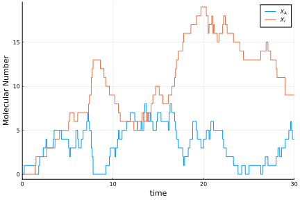
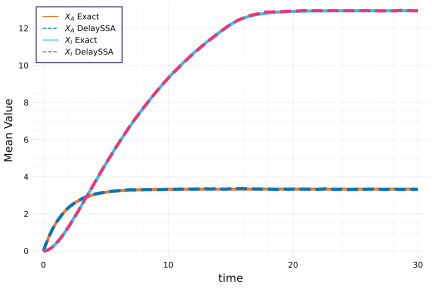
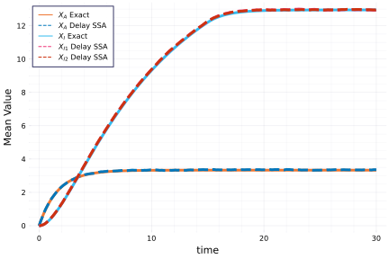

# A birth-death example with delay degradation

## Model

The model is defined as follows:

```math
\begin{aligned}
&\emptyset \xrightarrow{C} X_A, \\
&X_A \xrightarrow{\gamma} \emptyset,\\
&X_A \xrightarrow{\beta}  X_I, \text{ which triggers  } X_I\Rightarrow \emptyset \text{ after delay } \tau,\\
&X_I \xrightarrow{\gamma} \emptyset.  
\end{aligned}
```

Notice that the last reaction $X_I \xrightarrow{\gamma} \emptyset$ causes the delay channel to change its state during a scheduled delay reaction.

This example is studied by Lafuerza and Toral in [1], where one can solve the solution analytically. If we denote $\langle X_A\rangle(t)$ to be the mean value of $X_A$ at time $t$, and $\langle X_I\rangle(t)$ the mean value of $X_I$ at time $t$, then

```math
\langle X_A\rangle(t)= \frac{C}{a}( 1-e^{-at} ),\quad \langle X_I\rangle(t) = \begin{cases}
\frac{C\beta}{a-γ}\big[\frac{1-e^{-γt}}{γ}-\frac{1-e^{-at}}{a}\big]，& t \in [0,\tau]\\
\frac{C\beta}{a}\Big[\frac{1-e^{-γτ}}{γ}+\frac{(1-e^{\tau(a-γ)})}{a-γ}e^{-at}\Big], & t \in (\tau,\infty)
\end{cases}
```

where $a = β + γ$.

## Markovian part

```julia
using DiffEqJump, Catalyst, DelaySSAToolkit
rn = @reaction_network begin
   C, 0 --> Xₐ
   γ, Xₐ --> 0
   β, Xₐ --> Xᵢ
   γ, Xᵢ --> 0
end C γ β
jumpsys = convert(JumpSystem, rn, combinatoric_ratelaws = false)
```

We refer to [this example](tutorials.md) for more details about the construction of a reaction network. Then we initialise the problem by setting

```julia
u0 = [0, 0]
tf = 30.
saveat = .1
C, γ, β = [2., 0.1, 0.5]
p = [C, γ, β]
tspan = (0.,tf)
dprob = DiscreteProblem(u0, tspan, p)
```

## Non-Markovian part

Then we turn to the definition of delay reactions

```julia
τ = 15.
delay_trigger_affect! = function (integrator, rng)
   append!(integrator.de_chan[1], τ)
end
delay_trigger = Dict(3=>delay_trigger_affect!)
delay_complete = Dict(1=>[2=>-1]) 
delay_affect! = function (integrator, rng)
    i = rand(rng, 1:length(integrator.de_chan[1]))
    deleteat!(integrator.de_chan[1],i)
end
delay_interrupt = Dict(4=>delay_affect!) 
delaysets = DelayJumpSet(delay_trigger,delay_complete,delay_interrupt)
```

- `delay_trigger`
  - Keys: Indices of reactions defined in Markovian part that can trigger the delay reaction. Here we have the 3rd reaction $\beta: X_A \rightarrow X_I$ that will trigger the degradation of $X_I$ after time $\tau$.
  - Values: A update function that determines how to update the delay channel. In this example, once the delay reaction is triggered, the first delay channel (which is the channel for $X_I$) will be added to a delay time $\tau$.
- `delay_interrupt`
  - Keys: Indices of reactions defined in Markovian part that can cause the change in the delay channels. In this example, the 4th reaction $\gamma : X_I \rightarrow \emptyset$ will change the scheduled delay reaction channel immediately.
  - Values: A update function that determines how to update the delay channel. In this example, once a `delay_interrupt` reaction happens, one randomly picked reactant $X_I$ (supposed to leave the system after time $\tau$) is degraded immediately.
- `delay_complete`
  - Keys: Indices of delay channels. Here the first delay channel corresponds to $X_I$.
  - Values: A vector of `Pair`s, mapping species index to net change of stoichiometric coefficient. Here the second species $X_I$ has a net change of $-1$ upon delay completion.

Next, we choose a delay SSA algorithm and define the problem

```julia
de_chan0 = [[]]
djprob = DelayJumpProblem(jumpsys, dprob, aggregatoralgo,  delaysets, de_chan0, save_positions=(false,false))
```

where `de_chan0` is the initial condition for the delay channel, which is a vector of arrays whose *k*th entry stores the scheduled delay time for *k*th delay channel. Here we assume $X_I(0) = 0$, thus only an empty array.

## Visualisation

Now we can solve the problem and plot a trajectory

```julia
sol = solve(djprob, SSAStepper(), seed=2, saveat =.1)
```



Then we simulate $10^4$ trajectories and calculate the evolution of the mean value for each reactant

```julia
using DiffEqBase
ens_prob = EnsembleProblem(djprob)
ens =@time solve(ens_prob,SSAStepper(),EnsembleThreads(),trajectories = 1e4, saveat = .1)
```

### Verification with the exact solution

We compare with the mean values of the exact solutions $X_I, X_A$

```julia
timestamps = 0:0.1:tf
a = β + γ 
mean_x_A(t) = C/a*(1-exp(-a*t))
mean_x_I(t)= 0<=t<=τ ? C*β/(a-γ)*((1-exp(-γ*t))/γ - (1-exp(-a*t))/a) : C*β/a*((1-exp(-γ*τ))/γ + exp(-a*t)*(1-exp((a-γ)τ))/(a-γ))
```



# A multiple delay reaction example

We can also extend the model to include multiple delay reactions, i.e. multiple delay channels having simultaneous delay reactions

```math
\begin{aligned}
&\emptyset \xrightarrow{C} X_A,\\
&X_A \xrightarrow{\gamma} \emptyset,\\
&X_A \xrightarrow{\beta}  X_{I_1}+X_{I_2}, \text{ which triggers  } X_{I_1}, X_{I_2}\Rightarrow \emptyset \text{ after delay } \tau,\\
&X_{I_1} \xrightarrow{\gamma} \emptyset,\\
&X_{I_2} \xrightarrow{\gamma} \emptyset.
\end{aligned}
```

The 4th and 5th reactions will cause the delay channel to change its state during a scheduled delay reaction.

Similarly, we define the problem as follows:

## Markovian part

```julia
rn = @reaction_network begin
   C, 0 --> Xₐ
   γ, Xₐ --> 0
   β, Xₐ --> Xᵢ₁ + Xᵢ₂
   γ, Xᵢ₁ --> 0
   γ, Xᵢ₂ --> 0
end C γ β
jumpsys = convert(JumpSystem, rn, combinatoric_ratelaws = false)
```

```julia
u0 = [0, 0, 0]
tf = 30.
saveat = .1
de_chan0 = [[]]
tspan = (0.,tf)
dprob = DiscreteProblem(u0, tspan, p)
```

## Non-Markovian part

```julia
τ = 15.
delay_trigger_affect! = function (integrator, rng)
   append!(integrator.de_chan[1], τ)
   append!(integrator.de_chan[2], τ)
end
delay_trigger = Dict(3=>delay_trigger_affect!)
delay_complete = Dict(1=>[2=>-1],2=>[3=>-1]) 

delay_affect1! = function (integrator, rng)
    i = rand(rng, 1:length(integrator.de_chan[1]))
    deleteat!(integrator.de_chan[1],i)
end
delay_affect2! = function (integrator, rng)
    i = rand(rng, 1:length(integrator.de_chan[2]))
    deleteat!(integrator.de_chan[2],i)
end
delay_interrupt = Dict(4=>delay_affect1!,5=>delay_affect2!) 
delayjumpset = DelayJumpSet(delay_trigger,delay_complete,delay_interrupt)
```

```julia
de_chan0 = [[]]
djprob = DelayJumpProblem(jumpsys, dprob, aggregatoralgo,  delaysets, de_chan0, save_positions=(false,false))
```

## Visualisation

```julia
ens_prob = EnsembleProblem(djprob)
ens =@time solve(ens_prob,SSAStepper(),EnsembleThreads(),trajectories = 10^4, saveat = .1)
```



## References

[1] Lafuerza, Luis F., and Raul Toral. "Exact solution of a stochastic protein dynamics model with delayed degradation." Physical Review E 84, no. 5 (2011): 051121. [https://doi.org/10.1103/PhysRevE.84.051121](https://doi.org/10.1103/PhysRevE.84.051121)
