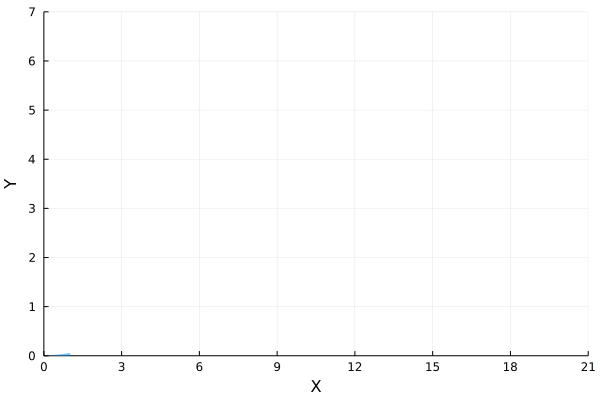

# An auto-regulatory model of oscillatory gene expression
## Model
Let us study the following auto-regulatory network with delay. The model is defined as follows:
```math
\emptyset \xrightarrow{J_1(Y)} X\\
 Y\xrightarrow{J_2(Y)} \emptyset
```
and $\emptyset \xrightarrow{J_1(Y)} X$ will trigger $X\Rightarrow Y$ after $\tau$ time.

According to [1], it's an illustration of an auto-regulatory network whereby a protein $X$ is transcribed by a gene, then it is transformed after a delay time $\tau$ into a mature protein $Y$, which binds the promoter and represses the transcription of $X$. The function $J_1(Y)$ and $J_2(Y)$ is defined as follows:
```math
J_1(Y)=k_1S\frac{K^p_d}{K^p_d+Y^p}\\J_2(Y)=k_2E_T\frac{Y}{K_m+Y}
```
In this example, we assume $k_1=k_2=S=E_T=K_d=K_m=1, p =2$ for simplicity.

## Markovian part
We can define the Markovian part of the system using Catalyst
```julia
rn = @reaction_network begin
    1/(1+Y^2), 0 --> X
    1/(1+Y),   Y --> 0
end
```
Then we convert the reaction network to a `JumpSystem`
```julia
jumpsys = convert(JumpSystem, rn, combinatoric_ratelaws=false).
```
We initialise the problem by setting
```julia
u0 = [0,0]
tf = 400.
tspan = (0,tf)
τ = 20.
dprob = DiscreteProblem(jumpsys, u0, tspan)
```
## Non-Markovian part
We define the `DelayJumpSet` by
```julia
delay_trigger_affect! = function (integrator, rng)
    append!(integrator.de_chan[1], τ)
end
delay_trigger = Dict(1=>delay_trigger_affect!)
delay_complete = Dict(1=>[2=>1, 1=>-1])
delay_interrupt = Dict()
delayjumpset = DelayJumpSet(delay_trigger, delay_complete, delay_interrupt)
```
To see how to define the `DelayJumpSet`, we refers to [this example](tutorials.md).
Thus, we can define the `DelayJumpProblem` by 
```julia
de_chan0 = [[]]
djprob = DelayJumpProblem(jumpsys, dprob, DelayRejection(), delayjumpset, de_chan0, save_positions=(true,true)).
```
## Solution and Visualisation
Now we can solve the problem and plot two trajectories of $X$ and $Y$.
```julia
sol_1 = solve(djprob, SSAStepper(), seed = 1)
sol_2 = solve(djprob, SSAStepper(), seed = 2)
```


Then we simulate $10^4$ trajectories and calculate the evolution of mean value for each reactant.
```julia
using StatsBase
ens_prob = EnsembleProblem(djprob)
ens = solve(ens_prob,SSAStepper(), EnsembleThreads(), trajectories = 1e4, saveat = .1)
```


If we plot how the mean of $Y$ varies with respect to the mean of $X$, we will find the following oscillatory orbit in the phase diagram.



## References

[1] Qingchao Jiang, Xiaoming Fu, Shifu Yan, Runlai Li, Wenli Du, Zhixing Cao, Feng Qian, Ramon Grima, "Neural network aided approximation and parameter inference of non-Markovian models of gene expression". Nature communications, (2021) 12(1), 1-12. [https://doi.org/10.1038/s41467-021-22919-1](https://doi.org/10.1038/s41467-021-22919-1)
